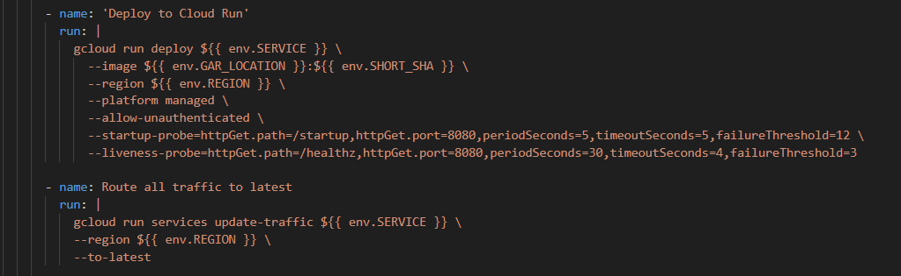

# I. Managing GCP Infrastructure with Terraform

See detailed instructions here:  
[https://github.com/dieuduytanck2k/terraform](https://github.com/dieuduytanck2k/terraform)

# II. CICD and others
# 1. Dockerfile

Explanation:

- `Multi-stage build:`
    - `deps:` install only production dependencies (excluding devDependencies).
    - `runtime:` copy code and node_modules from the first stage -> resulting in a smaller image.
- `USER node:` run the app as a non-root user for better security.
- `EXPOSE 8080:` the app runs on port 8080.
- `CMD:` start the app with server.js.

# 2. Create JSON key for serviceaccount from Terraform and save key to GitHub Secrets

# 3. Lint & unit tests

Runs all tests using Jest to ensure the application works correctly.

Checks code style and quality using ESLint (Airbnb style guide).

# 4. Trivy FS scan (repo)

Scans the repository and generates a SARIF report

Only checks for HIGH and CRITICAL vulnerabilities

Outputs results to trivy-fs.sarif

Upload results to GitHub Security > Code scanning 

- `exit-code:`

- `0:` pipeline continues even if vulnerabilities are found.

- `1:` pipeline fails when vulnerabilities are found.

# 5. Build image

Build image with two tags: SHORT_SHA and latest

# 6. Trivy Image scan

Scans the container image and generates a SARIF report

Only checks for HIGH and CRITICAL vulnerabilities

Outputs results to trivy-image.sarif

Upload results to GitHub Security > Code scanning 

- `exit-code:`

- `0:` pipeline continues even if vulnerabilities are found.

- `1:` pipeline fails when vulnerabilities are found.

# 7. Push Image with 2 tags

# 8. Deploy to Cloud Run with healcheck and Route traffic to latest version

Deploys the service with the new Docker image.

- `--allow-unauthenticated:` makes the service public.

- `Startup probe:` checks if the container starts correctly (/startup).

- `Liveness probe:` checks if the container stays healthy (/healthz).

Ensures 100% of traffic is routed to the most recent deployment.

# 9. Estimate cost

- **Github actions**
    - **Public repositories**: unlimited free usage with GitHub-hosted runners.  
    - **Private repositories**: free quota each month (per account plan):  
        - Free: 2,000 minutes + 500 MB storage  
        - Pro: 3,000 minutes + 1 GB storage  
        - Team: 3,000 minutes + 2 GB storage  
        - Enterprise: 50,000 minutes + 50 GB storage  
    - **Runners have multipliers**: Linux = 1×, Windows = 2×, macOS = 10×. 

    REF: https://docs.github.com/en/billing/concepts/product-billing/github-actions

- **Cloud Run**

    Pay only for what you use, rounded to the nearest 100ms.

    - **Billing includes**:
        - vCPU-seconds
        - Memory-seconds
        - Number of requests
        - Network egress

    - **Free tier (per month, us-central1 pricing)**:
        - 2M requests
        - 180,000 vCPU-seconds
        - 360,000 GiB-seconds memory

    REF: https://cloud.google.com/run/pricing?hl=en

- **Google Artifact Registry**:

    - **Storage**:
        - First 0.5 GB free per month.
        - Above 0.5 GB → $0.10 per GB / month.

    - **Data transfer**:
        - Free if traffic stays in the same region or continent (many intra-continent cases are free).
        - Cross-region transfer: $0.01–$0.15 per GB depending on regions.
        - Internet egress: follows Google Cloud networking pricing https://cloud.google.com/vpc/network-pricing?hl=en

    REF: https://cloud.google.com/artifact-registry/pricing